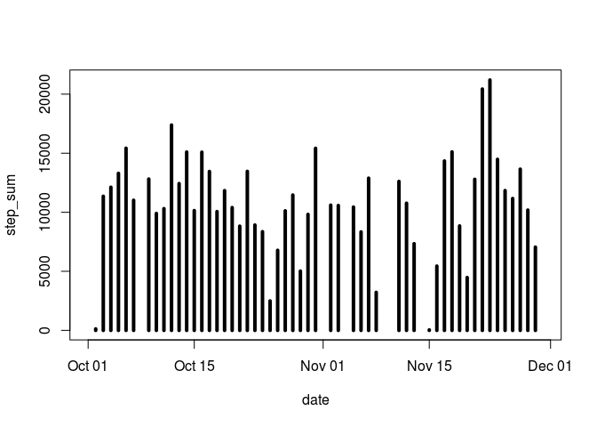
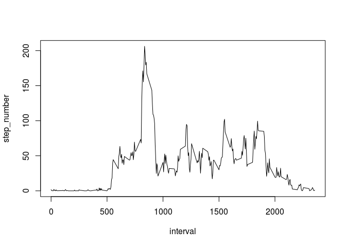
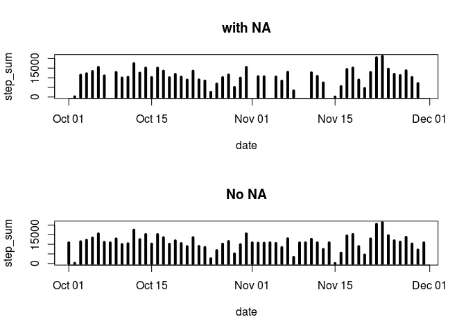
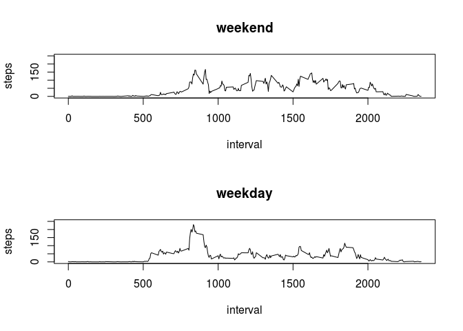

## Loading and preprocessing the data


```r
library(dplyr)
```

```
## 
## Attaching package: 'dplyr'
```

```
## The following objects are masked from 'package:stats':
## 
##     filter, lag
```

```
## The following objects are masked from 'package:base':
## 
##     intersect, setdiff, setequal, union
```

```r
library(lubridate)
```

```
## 
## Attaching package: 'lubridate'
```

```
## The following objects are masked from 'package:base':
## 
##     date, intersect, setdiff, union
```

```r
unzip("activity.zip")
activity <- read.csv("activity.csv")
```

## What is mean total number of steps taken per day?


```r
mean_steps_per_day <- group_by(activity, date)
steps_per_day <- summarise(mean_steps_per_day, step_sum = sum(steps))
```

```
## `summarise()` ungrouping output (override with `.groups` argument)
```

```r
steps_per_day$date <- ymd(steps_per_day$date)
plot(steps_per_day, type = "h", lwd = 4)
```

<!-- -->

```r
summary(steps_per_day$step_sum)
```

```
##    Min. 1st Qu.  Median    Mean 3rd Qu.    Max.    NA's 
##      41    8841   10765   10766   13294   21194       8
```

## What is the average daily activity pattern?


```r
steps_interval <- as.data.frame(activity$interval)
steps_interval <- cbind(steps_interval, steps_number = activity$steps)
names(steps_interval) <- c("interval", "step_number")

mean_steps_interval <- aggregate(step_number ~ interval, steps_interval, mean)
plot(mean_steps_interval, type = "l")
```

<!-- -->

```r
msi_ordered <- mean_steps_interval[order(mean_steps_interval$step_number, decreasing = TRUE),]
head(msi_ordered)
```

```
##     interval step_number
## 104      835    206.1698
## 105      840    195.9245
## 107      850    183.3962
## 106      845    179.5660
## 103      830    177.3019
## 101      820    171.1509
```
## Imputing missing values

```r
na_number <- sum(is.na(activity$steps))
na_number
```

```
## [1] 2304
```

```r
{ 
  new_activity <- activity
  
  for (i in 1:17568)  {
    if (is.na(new_activity[i, 1]) == TRUE) {
      which_interval <- new_activity[i, 3]
      mean_step <- mean_steps_interval[mean_steps_interval$interval == which_interval, 2]
      new_activity[i, 1]  <- mean_step
                                           }
                      }
}
new_activity$date <- ymd(new_activity$date)

mean_steps_per_day2 <- group_by(new_activity, date)
steps_per_day2 <- summarise(mean_steps_per_day2, step_sum = sum(steps))
```

```
## `summarise()` ungrouping output (override with `.groups` argument)
```

```r
par(mfcol = c(2, 1))
plot(steps_per_day, type = "h", lwd = 4, main = "with NA")
plot(steps_per_day2, type = "h", lwd = 4, main = "No NA")
```

<!-- -->
Summary with NA

```r
summary(steps_per_day$step_sum)
```

```
##    Min. 1st Qu.  Median    Mean 3rd Qu.    Max.    NA's 
##      41    8841   10765   10766   13294   21194       8
```
Summary without NA

```r
summary(steps_per_day2$step_sum)
```

```
##    Min. 1st Qu.  Median    Mean 3rd Qu.    Max. 
##      41    9819   10766   10766   12811   21194
```

## Are there differences in activity patterns between weekdays and weekends?

```r
week_new_activity <- new_activity
week_new_activity$day <- weekdays(new_activity$date)
week_new_activity$weekend <- "weekday"

{
  for (i in 1:17568)  {
    if (week_new_activity[i, 4] =="Sunday" | 
        week_new_activity[i, 4] =="Saturday")  {
          week_new_activity[i, 5] <- "weekend"
                                               }
                      }
}
week_new_activity$weekend <- as.factor(week_new_activity$weekend)

weekend_sub <- subset(week_new_activity, weekend == "weekend")
weekend_ave <- aggregate(steps ~ interval, weekend_sub, mean)

weekday_sub <- subset(week_new_activity, weekend == "weekday")
weekday_ave <- aggregate(steps ~ interval, weekday_sub, mean)

par(mfcol = c(2, 1))
plot(weekend_ave, type = "l", lwd = 1, main = "weekend", ylim = c(0, 250))
plot(weekday_ave, type = "l", lwd = 1, main = "weekday", ylim = c(0, 250))
```

<!-- -->
